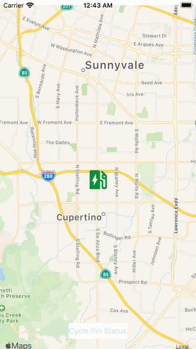
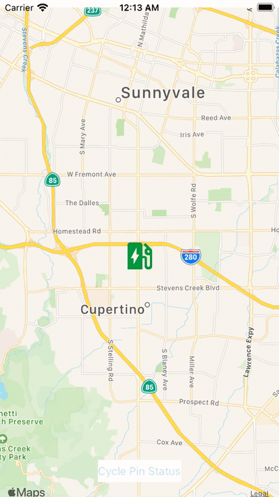

# FB8708184
iOS 14 GM Bug - Feedback Assistant FB8708184

## Purpose

This is a sample code project that replicates a bug in iOS 14 GM when the MKAnnotationView's image is set while the view is still on screen. Run "iOS14MapBug" & press the "Cycle Pin Status" button to cycle the MKAnnotationView's image.

### Expected Behavior

As seen on iOS 13



### Actual Behavior

As seen on iOS 14 GM



## Workaround

The issue in iOS 14 GM appears to be in the animation of the CALayer that is backing the image. A switch has been provided in the codebase to show a workaround that involves disabling animations while setting MKAnnotationView's image & then adding back an animation that duplicates what the MapKit framework was attempting to add.

If you have a MKAnnotationView subclass, you can workaround the issue like this:

```
- (void)setImage:(UIImage *)image {
    // Feedback Assistant ticket: FB8708184
    //
    // With iOS 14, setting the MKAnnotationView's image leads to a glitched CABasicAnimation when using images of the same size
    // from an asset catalog.
    //
    // To work around this, we create our own version of the system animation that isn't glitched, prevent
    // the system from adding the glitched system provided one, & then add our animation once the image sets are done.
    if (@available(iOS 14, *)) {
        CALayer *imageLayer = self.layer.sublayers.firstObject;

        CABasicAnimation *animation = [CABasicAnimation animationWithKeyPath:@"contents"];
        animation.fromValue = imageLayer.contents;
        animation.toValue = (__bridge id)image.CGImage;
        animation.fillMode = kCAFillModeBackwards;
        animation.timingFunction = [CAMediaTimingFunction functionWithName:kCAMediaTimingFunctionDefault];
        animation.duration = 0.25;

        // Now let's update the image but disable CAAnimations so the buggy iOS 14 contents animation doesn't occur
        [CATransaction begin];
        [CATransaction setValue:(id)kCFBooleanTrue
                         forKey:kCATransactionDisableActions];
        [super setImage:image];
        [CATransaction commit];

        // Add our version of the contents animation
        [imageLayer addAnimation:animation forKey:@"contents"];
    } else {
        // iOS 13 and below don't have the glitched CABasicAnimation, so no workaround needed
        [super setImage:image];
    }
}
```
